### 팀원 정보 및 업무 분담

- 이흔오 :  & 
- 장현욱 :  & 

### 사용 기술

             

### 설계 내용 => 어디서 무엇을 만들었는가

- MainView :

  1. 로그아웃의 경우 : 사이트에 대한 간단한 설명 및 로그인과 회원가입 페이지로 이동하는 링크 구현
  2. 로그인의 경우 : 대표적인 은행들의 금융상품을 볼 수 있는 아이콘 배치

- ExchangeView : 그날의 환율을 그래프로 보여주며, 원하는 금액 입력시 그에 맞는 원화의 금액 보여주는 기능

- ListView : 금융 상품 리스트를 간단한 설명과 함께 카드로 보여주기, 원하는 상품의 Detail 버튼 클릭시 ListDetailModal 을 띄워 상세 정보를 보여주는 기능, 지도를 보여주는 아이콘 배치 및 클릭시 모달로 보여주기

- ListDetailModal : 원하는 금융 상품의 상세정보를 보여주며, 해당 상품에 대한 댓글 입력, 실시간 확인 기능 구현

- MyPageView : 유저 정보, 닉네임&이메일 변경 기능

- Locations : 원하는 두개의 상품을 장바구니에 담은 후 비교하는 기능

### 컴포넌트 구조

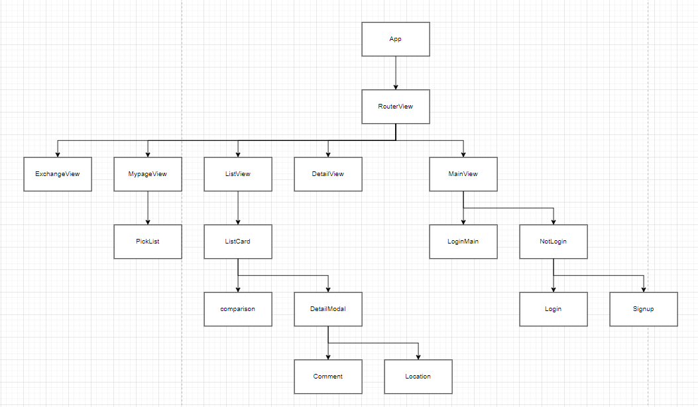

### 금융상품 추천 알고리즘에 대한 기술적 설명

- 랜덤 뽑기에 대한것 써보기
- 인기순 리스트 뽑는거
- 추가해볼만한것 => 급해요, 큰돈이 필요해요 등 테마에 따른 추천도 만들어보기

### 디자인 컨셉

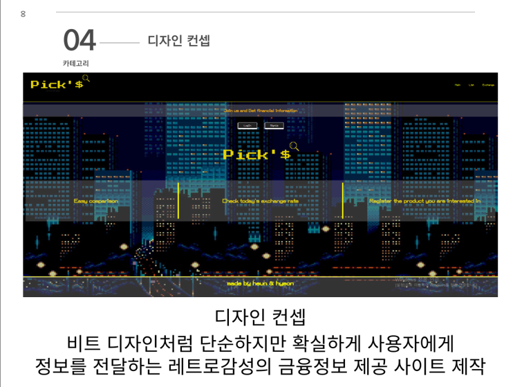

### 서비스 기능 화면

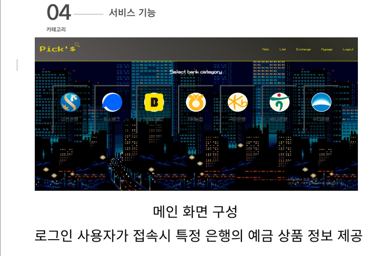

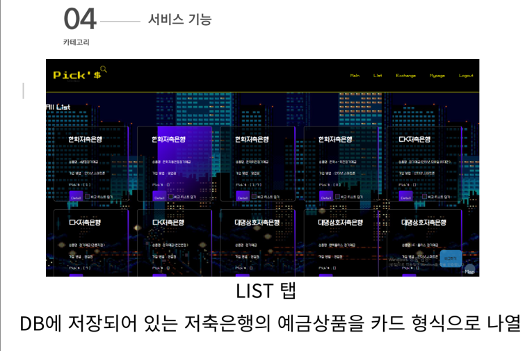

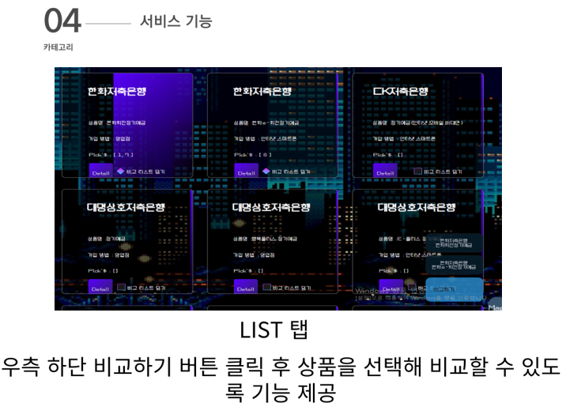

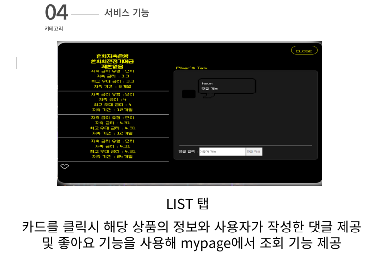

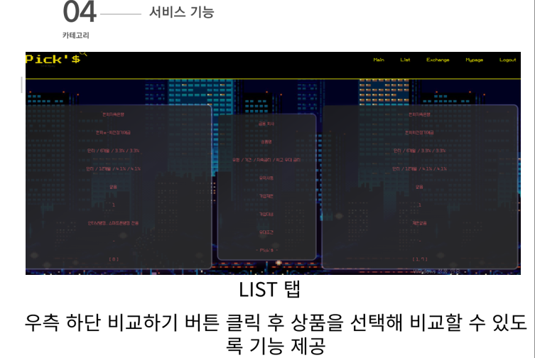

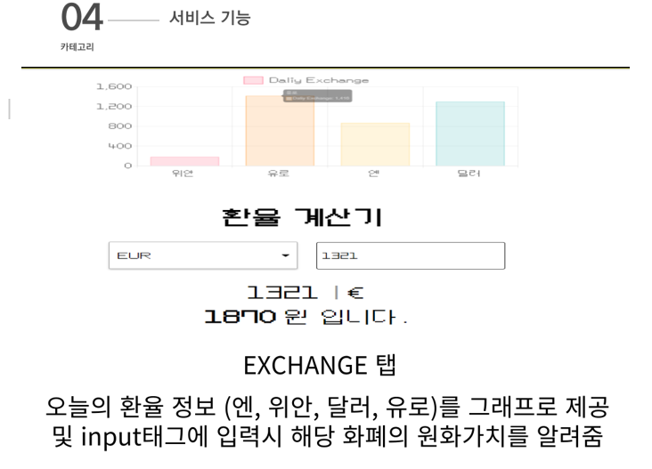

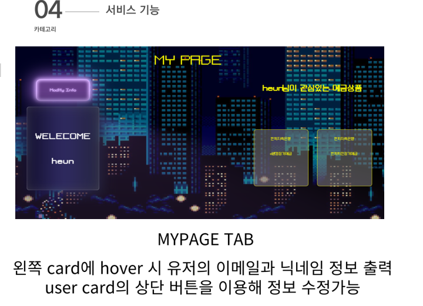

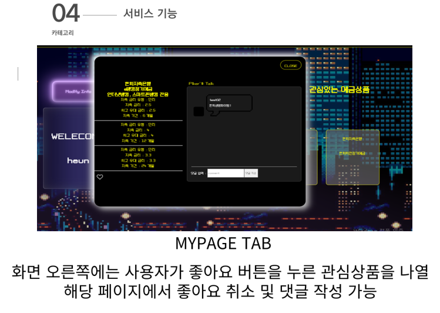

### 서비스 대표 기능들

- 특정 은행의 예금 상품 정보 제공
- DB에 저장되어 있는 예금상품을 보기 좋게 나열, 비교, 상세정보 확인
- 특정 상품에 대한 댓글 기능
- 상품 좋아요 기능
- 환율 계산 시스템
- 근처 은행 찾기 시스템

### 구현 실패 기능

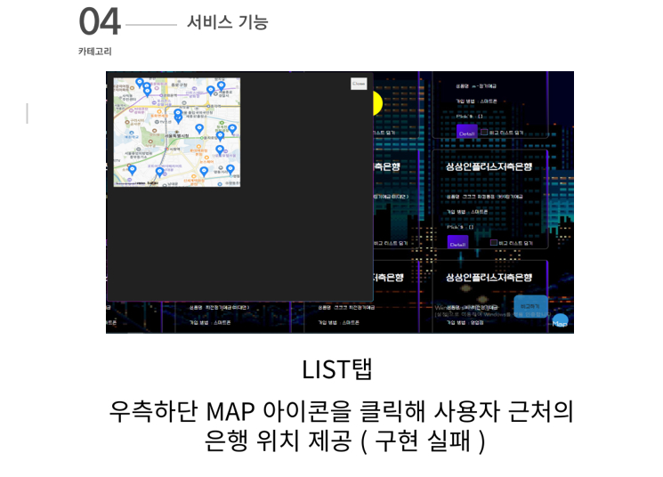

카카오맵 API를 사용하여 구현하려 헀으나, 원하는 위치 정보를 불러오는데 실패하여 구현에 실패함.

### 느낀점 & 후기

- 처음 도전하는 프로젝트라 긴장도 많이 되었고, 무엇보다 내가 정말로 할 수 있는걸까 하는 의심도 많이 했던것같습니다.
  이번 프로젝트를 진행하면서 스스로 부족함을 특히 백엔드 쪽에서 장고를 사용하여 데이터를 연결하고 저장하는데에 많이 부족함을 느꼈고, 스스로 막막함과 답답함을 많이 느꼈습니다. 하지만 포기하지않고 모달, 프론트에서 계정을 연결하는 방법, 데이터를 불러오는 방법 등 여러가지를 스스로 찾아보거나 주위에 조언을 구하며 조금씩 진행을 해 나갔고, 그 결과 프로젝트를 완성할 수 있었습니다.
  이를 통해 기술적으로 막힐때에 스스로 해결해 나갈수 있는 능력을 키웠고, 처음 경험하는 프로젝트 협업을 통해 서로 어떤식으로 역할을 분담하고, 해결해 나가며, 계획을 구상하는지 등등 전반적인 프로젝트를 해 나가는 단계를 배우고 알게된것같습니다.
